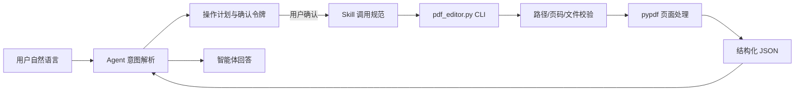

# 《智能体开发实战》实验报告：AI PDF 页面编排

2026-09-06对话版补充：已新增控制台连续对话、Ollama模型接口、参数追问和区域裁剪；26项原测试和15项新增测试通过。最新架构、低Token设计、任务书对照和限制以《对话版验收说明.md》为准。真实模型未配置，模型相关测试为模拟，不能记为真实模型验收通过。下文及Word中的旧架构和测试数为历史版本。

修订说明（2026年9月5日）：后文16项测试对应早期基线；当前26项已全部通过，新增修复详见《需求汇总与检查记录》。三周总结为预拟内容，须在实习结束后核实，不作为已发生事实提交。已有Word报告及申报书仍为9月4日快照。

项目编号：任务书 11  
实习周期：2026 年 8 月 31 日至 2026 年 9 月 20 日  
核心开源依赖：pypdf 6.10.0  

## 摘要

本项目面向学习、办公和资料整理中常见的 PDF 页面级编排需求，实现了一个可由中文自然语言驱动、又保持确定性与可审计性的轻量智能体。系统支持页面提取、页面删除、多个文件合并、自定义排序或倒序、指定页面旋转五类核心操作。与“让模型直接操作文件”的模糊方案不同，本项目把智能体的语言理解职责和 PDF 工具的执行职责严格分开：Agent 只把自然语言转换为明确意图并组织确认，Skill 规定何时调用、怎样校验和怎样解释结果，Script/CLI 负责参数验证与结构化协议，pypdf 负责真正的 PDF 对象读写。最终结果以精简 JSON 返回，既便于 Agent 稳定解析，也避免把 PDF 内容放入模型上下文而浪费 Token。

项目特别落实了安全红线。任何写操作都先生成可读计划，用户明确确认后才执行；默认生成新文件，不覆盖原文档；所有输入输出必须位于用户指定目录；损坏、加密、空文件、非法页码和越界等情况均被转换为固定错误码；日志仅记录文件名和操作状态，不记录路径、文档内容、令牌或敏感字段。项目使用 16 项自动化测试验证五类功能、边界、异常、安全限制和 Agent 全链路，实测全部通过。该结果说明，面向封闭工具任务的智能体不必依赖大型框架，也可以通过清晰契约、分层设计与防御性编程获得可靠的工程质量。

关键词：智能体；PDF；pypdf；Skill；结构化输出；安全确认

## 一、项目背景与需求分析

### 1.1 背景

PDF 具有跨平台、版式稳定的优点，因此课程资料、调研报告、合同附件和归档材料经常使用 PDF 交付。但普通用户面对“只取其中几页”“去掉封面”“把附件接到正文后”“把扫描方向转正”之类任务时，往往需要寻找图形软件、上传在线网站或学习复杂命令。在线工具还可能带来隐私泄露；纯命令行工具则要求用户记忆参数。自然语言智能体能够降低操作门槛，但如果直接让语言模型决定文件读写细节，又会产生页码误解、路径越界和未经确认覆盖等风险。

本实验的目标不是构造通用 PDF 编辑器，而是在明确边界内解决页面级编排。核心处理必须使用 Python 原生生态中的 pypdf，不用 PyMuPDF 等库替代；交互链路必须体现 Agent、Skill 和 Script 的层次；执行过程必须可复现、可测试、可解释。由此，本项目把“自然、友好”放在 Agent 层，把“严格、确定”放在 CLI 层，避免两类目标互相干扰。

### 1.2 用户场景

第一类场景是资料节选。学生可能只需论文附件中的第 2 至 4 页，教师也可能从讲义中抽取某一章节。系统接受“把 report.pdf 的第2到4页单独提取出来”，生成新文件并报告处理页码和总页数。第二类场景是整理与组合。用户可以删除多余封面，把两个附件按顺序合并，或把倒序扫描的文档整体反转。第三类场景是页面方向修正，例如“把 report.pdf 第2页旋转90度”。这三类场景已经覆盖课程要求的至少三类自然语言意图，同时细分为五项确定性操作。

系统不处理 OCR、文字替换、图像编辑、压缩、签名、解密与复杂表单。这不是功能缺失，而是主动建立能力边界。页面编排可以通过 pypdf 稳定完成，而内容编辑需要不同的渲染、字体和识别技术。若把它们混在本实验中，会增加依赖和不可控因素，也偏离任务书重点。

### 1.3 功能与非功能需求

提取操作接受单页、逗号列表和连续范围；删除操作保留未删除页面，并拒绝删除全部页面；合并操作接受两个以上输入，并可为每个输入指定 `all` 或独立页码；重排要求原文档每页恰好出现一次，也提供倒序快捷方式；旋转只接受 90、180、270 度。所有页码面向用户均从 1 开始，只有访问 pypdf 页面数组时才转换为从 0 开始的索引。

非功能需求包括可靠性、安全性、可复现性和低上下文开销。可靠性要求所有预期错误都被捕获，stdout 始终是单个 JSON 对象，退出码可以被自动化程序判断。安全性要求目录白名单、默认不覆盖、执行前确认、日志脱敏和临时文件原子替换。可复现性要求依赖固定版本，测试自行生成样例而不依赖网络。性能要求不解析页面视觉内容，不把二进制或全文送给 Agent，只传参数和统计摘要。

## 二、总体架构与技术选型

### 2.1 完整链路

Agent 入口位于 `agent/agent_entry.py`。它识别动作词、PDF 文件名、页码、旋转角度和输出名，不直接导入 pypdf，也不写最终文件。`skills/pdf-page-editor/SKILL.md` 是能力说明与调用合同，列出触发条件、不适用范围、参数、确认顺序、成功和失败结果。`pdf_editor.py` 是唯一执行核心，所有真实页面操作都经 pypdf 完成。该分层保证无论未来 Agent 换成模型解析还是图形界面，底层行为与测试契约都不变。

### 2.2 不采用大型 Agent 框架的原因

课程允许选用框架，但本项目没有使用 nanobot。原因并非回避智能体，而是任务意图集合封闭，输入字段少，主要难点是文件安全和确定性处理。若引入通用规划、记忆、工具注册和网络模型调用，会增加安装步骤、密钥管理、响应波动与测试成本。当前轻量 Agent 已完整承担自然语言解析、风险预览、确认状态管理、Skill 调用和结果组织，满足技术路线定义。规则式解析失败时明确要求用户改写，也比在高风险文件操作中猜测更合理。

### 2.3 pypdf 技术选型

pypdf 是纯 Python PDF 库，可以读取页面树、复制页面对象、修改旋转属性并写出新文档。提取与合并本质上都是按顺序向 `PdfWriter` 增加页面；删除通过构造补集实现；重排按照用户给定索引重新加入；旋转调用页面对象的 rotate 方法。这样五种操作共享同一读写模型，代码量较小，行为容易验证。依赖锁定为 6.10.0，避免不同版本 API 差异影响课程复现。项目遵循其 BSD-3-Clause 许可证，并在 README 中说明。

## 三、关键实现

### 3.1 CLI 与 JSON 契约

CLI 使用 argparse 建立五个子命令。全局参数 `--allowed-dir` 决定文件边界，`--log-dir` 可调整日志位置。成功 JSON 包含 `status`、`operation`、输入文件、输出文件、处理页码、输出总页数和中文消息；失败 JSON 包含 `status`、`operation`、`error_code` 和 `error_message`。stdout 不输出进度、帮助说明或调试文字，人类诊断只进入 stderr。为了覆盖参数缺失这类在业务代码执行前发生的错误，项目重写了 argparse 的 error 边界，将其转换为 `INVALID_ARGUMENT`，因此“合并空列表”仍遵循 JSON 契约。

Windows 中文环境暴露了一个真实联调问题：父进程按 UTF-8 解码，而子进程可能依据系统代码页输出，导致 JSON 字节无法解析。两个入口都显式将标准输出与错误输出配置为 UTF-8，修复后 16 项测试通过。这个问题说明结构化格式本身并不足够，字符编码也是跨进程契约的一部分。

### 3.2 页码解析与操作语义

`parse_pages` 接受 `2`、`1,3,5`、`2-4` 以及组合形式。它先用严格正则判断语法，再校验起止值和文档总页数，最终保留用户可理解的 1-based 列表。非法字符、零、负数、反向范围和越界分别得到清楚错误。重复页码在提取中可以表达复制需求，但重排另有更严格校验：长度必须等于原页数，排序后的集合必须正好是 1 到 N，因此既不能遗漏也不能重复。

删除并不修改原 reader，而是计算保留页面后写入新的 writer。若保留列表为空，返回 `NO_PAGES_REMAIN`。合并为每个输入独立打开 reader 和解析页码，再按输入顺序追加。旋转仅改变目标页的 `/Rotate` 语义，其余页面原样复制。写出时先生成同目录隐藏临时文件，成功后再替换目标，避免中途异常留下看似完整的损坏文件。

### 3.3 Agent 意图解析

Agent 首先提取带 `.pdf` 后缀的文件名，再根据“提取、删除、合并、排序、倒序、旋转”等动作词分类。页码支持阿拉伯数字以及常用中文数字，范围支持“到、至、短横线”。合并至少需要两个文件；旋转必须提供三个允许角度之一；缺少关键槽位时返回 `INTENT_NOT_UNDERSTOOD`。解析策略宁可拒绝不明确请求，也不静默猜测。对复杂逐文件范围，Skill 文档引导使用 CLI 的 `--page-specs`，从而保持自然语言入口简洁。

### 3.4 预览与确认

收到 `--request` 后，Agent 只生成计划，不调用 Script。计划明确说明输入、页码、输出和是否覆盖，同时创建随机确认令牌。待确认数据保存在项目的临时目录，含解析后的意图、允许目录、创建时间和请求摘要。令牌十分钟失效，并在真正执行前删除，因此重复提交不会再次写文件。用户显式要求覆盖时，计划会突出风险，底层命令也只有在意图带有覆盖标记时才加入 `--overwrite`。这一设计让“用户确认”不是一句文档承诺，而是代码路径上的强制状态转换。

## 四、安全与异常处理

第一，写文件前预览和确认覆盖全部操作，而不仅是删除与合并。统一规则更容易理解，也防止提取或旋转覆盖已有输出。第二，默认输出名增加操作后缀，输出存在时返回 `OUTPUT_EXISTS`；输出若等于任何输入且没有显式覆盖标记，则返回 `OVERWRITE_FORBIDDEN`。原始 PDF 因而默认保持只读。

第三，目录限制使用解析后的规范绝对路径进行归属判断，而不是简单字符串前缀。`../`、绝对系统路径以及名字相似但不属于子目录的路径都会被拒绝。输入与输出都执行同样检查，所以攻击者不能从允许目录读取后写到系统目录。第四，文件层异常被归类为不存在、非 PDF、空文件、空 PDF、加密 PDF、损坏或无法读取。加密文件无论是否可能使用空密码打开都直接拒绝，因为项目没有设计密码授权与保管流程。

第五，日志每行仅包含 UTC 时间、操作类型、输入输出基名、状态与错误码。它不记录绝对路径、自然语言原文、页面内容、确认令牌、密码、API Key 或环境变量。代码不是靠搜索关键词后再遮盖，而是采用允许字段清单，从源头不接收敏感内容，降低漏脱敏概率。真实 `operations.log` 被版本控制忽略，仓库只提供人工构造的脱敏示例。

最后，主函数设置两层异常边界。可预期问题用稳定 error_code 表达，未知异常只返回异常类型而不暴露 traceback、路径和内部对象。写文件使用临时文件加替换；即便写入失败，finally 也会清理临时项。安全措施由测试 TC07、TC11、TC13、TC14、TC15 和 TC16 直接验证，而不是只停留在说明文字。

## 五、测试设计与结果

### 5.1 方法

测试采用 Python 标准库 unittest，减少额外依赖。每个用例建立独立临时目录，使用 pypdf 自动生成空白样例。不同页设置不同宽高，因此可以验证重排后的第一页确实来自原第二页，而不只是检查页数。旋转结果通过重新打开 PDF 并检查 rotation 属性验证。加密样例在测试中即时生成；所有文件在用例结束后清理，不需要下载有版权的公开 PDF，也不会污染仓库。

### 5.2 结果表

| 测试组 | 代表内容 | 数量 | 结果 |
|---|---|---:|---|
| 正常功能 | 提取、删除、合并、重排、倒序、旋转 | 6 | 全部通过 |
| 边界 | 第一页、最后一页、单页删除 | 3（与功能项部分重合） | 全部通过 |
| 输入异常 | 越界、缺失、非 PDF、加密、非法页码、空合并列表 | 6 | 全部通过 |
| 安全 | 目录逃逸、已有输出保护 | 2 | 全部通过 |
| 全链路 | Agent 预览时不写文件，确认后写出 | 1 | 通过 |
| 总计 | 自动化测试方法数 | 16 | 16/16 通过 |

首次执行测试时，业务逻辑并未失败，但 Windows 管道编码导致 16 项都无法解析中文输出。定位后在两个程序入口固定 UTF-8，第二次执行显示 `Ran 16 tests` 和 `OK`。保留这一过程具有教学意义：测试不仅证明预期功能，也发现了开发者在单进程手工调用时容易忽略的环境问题。最终结果以终端汇总和 `tests/test_cases.md` 的用例表作为可复现证据，不用不可更新的截图冒充当前状态。

### 5.3 验收对应

五类基础操作各有至少一个正常测试；末页旋转和首页删除验证边界；单页删除验证不会产生空 PDF；空列表通过 argparse JSON 化验证；缺失文件、伪 PDF、加密文件、非法页码和越界均有独立用例；目录逃逸与覆盖保护验证安全；最后一个用例从中文请求开始，断言预览阶段输出不存在，再用令牌确认并断言三页新文件出现。测试范围超过任务书要求的八项最低数量。

## 六、性能与低 Token 优化

本项目不把 PDF 二进制、页面全文或对象树返回给模型。Script 只输出操作名、文件名、页码、页数、状态和短消息。即使处理上百页，Agent 上下文仍只接收几十到几百字节的摘要。页面选择也不进行渲染和 OCR，仅复制 pypdf 页面对象，内存和时间主要随被处理页面对象规模增长。此设计同时减少 Token、延迟和文档内容泄漏。

第二项优化是把确定性校验下沉到 Script。Agent 不需要通过多轮推理判断每个页码是否合法，CLI 读取页面总数后一次校验并返回错误码。第三项优化是封闭意图：规则解析直接产生参数，常见请求不需要网络模型。第四项优化是测试样例按需生成，避免在仓库和上下文中存储大型附件。若未来处理超大文件，可以增加最大输入数量、最大选页数与文件大小阈值，并在计划中展示估算，但本次任务没有擅自设置可能阻碍正常课程样例的硬上限。

## 七、实习过程总结

第一周遵循“先工具后 Agent”。我先把任务书转换为验收清单，设计 JSON 契约和页码语法，再依次实现提取、删除、旋转、合并和排序。这个阶段最大的认识是，库函数能运行不代表工具可交付。对用户真正重要的是边界：页码从几开始、输出已存在怎么办、损坏文件如何提示、执行一半是否留下垃圾文件。因此核心 Script 从一开始就围绕输入验证和明确失败设计，而不是完成后再补异常处理。

第二周封装 Skill 并接入 Agent。Skill 写作迫使我用调用者视角重新审查接口：哪些话应该触发能力，哪些任务必须拒绝，参数怎样对应，结果怎样判断。Agent 联调又让我认识到确认机制需要可执行状态，而不是在提示词里写“请谨慎”。一次性令牌、期限和执行前销毁把安全要求落实为程序流程。编码故障则说明跨平台细节也属于架构质量。

第三周集中测试和文档。我从只检查退出码改为重新读取输出 PDF，检查页数、宽度和旋转属性；这使测试能够发现语义错误。随后用异常和安全用例倒推代码缺口，尤其处理了 argparse 默认输出非 JSON 的问题。最后整理 README、日志示例、每日记录与一分钟 Demo，使代码不依赖开发者口头解释也能安装、运行和验收。三周过程形成了需求、实现、测试、说明、演示的闭环。

## 八、专业认识提升

本实验加深了我对智能体工程的认识。智能体的价值不等于调用大模型次数多，而在于能否把不确定的用户表达安全地连接到确定的工具。在本项目中，语言层允许一定灵活性，执行层则只接受严格参数；Skill 是两者之间的契约。这样的分层适用于文件、数据库、自动化运维等更多场景。尤其在会改变用户数据的操作中，最小权限、明确计划、确认和幂等保护应当是基础能力。

我也更具体地理解了软件测试。正常路径只能说明功能大致可用，边界和失败路径才揭示接口是否可靠。测试加密文档、目录逃逸和编码问题，使我看到安全与兼容性不是独立章节，而是可自动验证的行为。结构化错误码比异常文字更稳定，原子写入比“发生错误后提醒用户”更主动，允许字段式日志比事后脱敏更稳健。这些工程习惯可以迁移到后续课程项目。

开源依赖方面，我认识到“使用 pypdf”不仅是安装库。还应固定版本、了解许可证、限定它在架构中的职责、对输入进行外围防护，并通过读取写出结果验证行为。依赖越少，供应链和复现成本越低；但减少依赖不能成为省略质量控制的理由。本项目使用标准库完成参数、日志、进程和测试，把第三方依赖集中在 PDF 核心，边界清晰。

## 九、实习收获与个人发展规划

这次实习让我从“完成一个能跑的脚本”转向“交付一个别人能安全使用并验证的系统”。需求分析阶段学会把自然语言任务书拆成可检查条目；实现阶段学会在功能代码旁同步设计错误和权限；联调阶段学会关注编码、进程协议和状态生命周期；收尾阶段学会用 README、报告和 Demo 为不同读者组织信息。相比单纯增加代码量，这种贯穿全周期的质量意识是更重要的收获。

在学业发展上，短期计划是继续学习 PDF 对象模型、Python 类型标注、属性测试和安全路径处理，并尝试为页码解析增加更系统的语法测试。中期计划是学习模型工具调用与结构化输出，在保持现有 CLI 不变的前提下，将规则解析替换或补充为可评测的模型解析器，比较准确率、成本和延迟。对于高风险意图仍保留确认层，避免把模型置信度误当授权。

长期方向是把智能体工程与软件工程、安全工程结合。未来项目将优先建立能力边界、最小权限和可观测性，再考虑更复杂的规划与记忆。同时提升文档写作和演示能力，使设计取舍、测试证据和已知限制能够被教师、同学或实际用户快速理解。AI 工具会不断变化，但清晰契约、可复现测试、数据保护和诚实说明限制具有长期价值。本项目规模不大，却提供了一个完整范例：从自然语言出发，经受控智能体和标准化 Skill，最终落到可审计的确定性工具，并把结果安全地交还用户。

## 十、结论

项目已按任务书完成目录、Script、Skill、Agent、测试、日志示例、README、实验报告、每日记录和演示脚本。核心功能完全由 pypdf 实现，没有引入大型 Agent 框架或替代 PDF 库。五项操作均遵守 JSON 输出契约，所有写入经过预览确认，默认保护原文件，并受到目录白名单与异常边界约束。16 项自动化测试全部通过，覆盖正常、边界、异常、安全和端到端场景。实验表明，通过分层架构和严格协议，可以在较低依赖、较低 Token 消耗下构建一个实用、可解释且可复现的 PDF 页面编排智能体。
